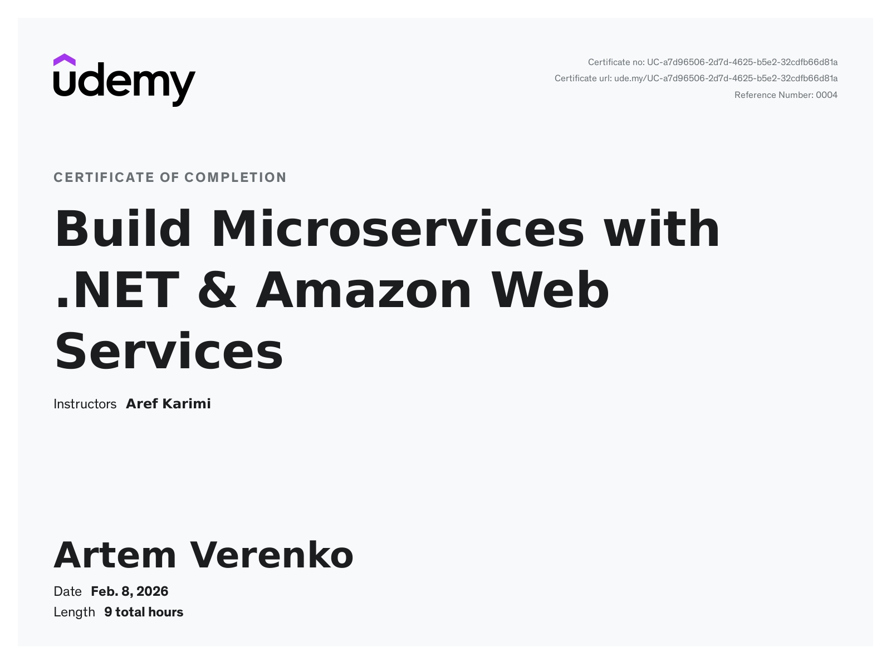
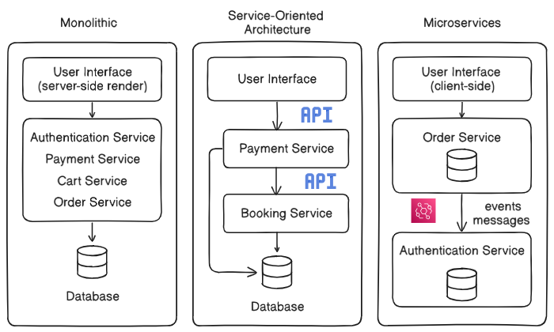
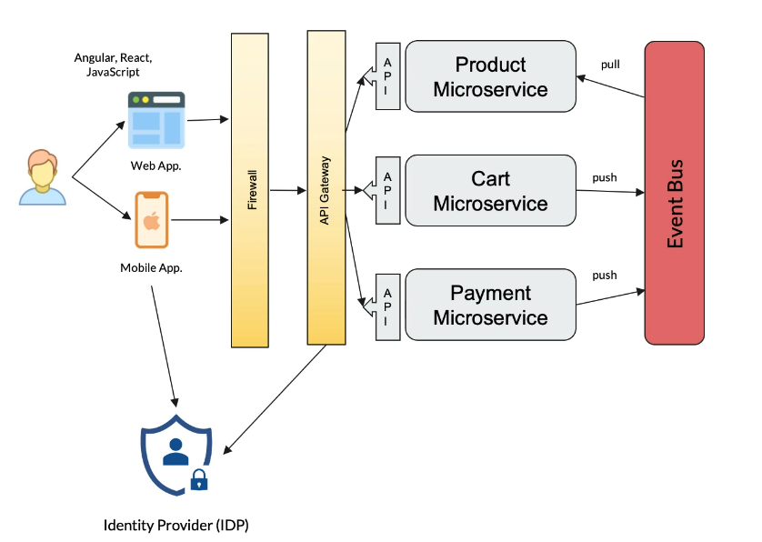
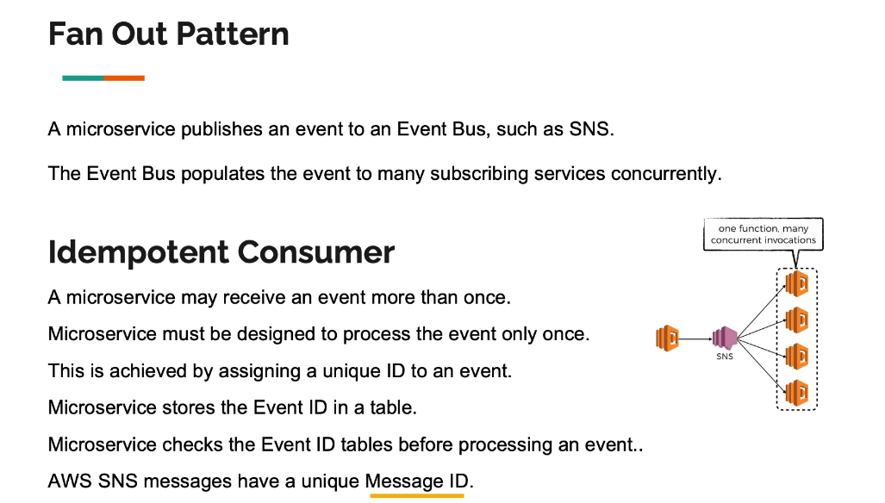
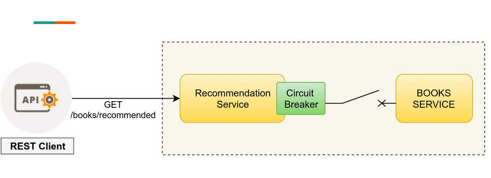

# So, here they are - microservices

This short article is a collection of my notes from a course I recently took on Udemy [certificate](https://www.udemy.com/certificate/UC-a7d96506-2d7d-4625-b5e2-32cdfb66d81a/).

Below, I've organized my learnings into the style of **answers to common system design interview questions**.

---

## 1. Microservices VS Monolithic Application

### Q: What is the actual difference between Monolithic and Microservices architectures?

## Comparison of Software Architectures

| Criterion           | Monolithic                                               | Service-Oriented (SOA)                                     | Microservices                                                         |
| :------------------ | :------------------------------------------------------- | :--------------------------------------------------------- | :-------------------------------------------------------------------- |
| **Coupling**        | **Tight:** Components are deeply interdependent.         | **Medium:** Services are linked via a common bus (ESB).    | **Loose:** Services are fully independent and decoupled.              |
| **Scalability**     | **Vertical:** Must scale the entire application at once. | **Horizontal:** Scaling of individual large services.      | **Granular:** Scale only the specific services that need it.          |
| **Communication**   | In-memory function calls (fast but rigid).               | Heavy protocols like SOAP, WSDL, and Enterprise Bus.       | Lightweight protocols: REST, gRPC, or Message Brokers.                |
| **Data Management** | **Single Shared DB:** One big database for everything.   | **Shared DB:** Often multiple services share one database. | **Database per Service:** Each service owns its private data.         |
| **Deployment**      | **Big Bang:** One change requires a full re-deployment.  | **Coordinated:** Deployment of service groups.             | **Independent:** Continuous Delivery (CI/CD) for each service.        |
| **Fault Tolerance** | **Low:** One bug can crash the entire system.            | **Moderate:** ESB can become a single point of failure.    | **High:** Fault isolation; if one service fails, others keep working. |

---

- **The Monolith:** Think of this as "all eggs in one basket." All services and functions live in one massive application. **The Problem:** If you want to change just _one_ tiny service, you have to redeploy the _entire_ application. If one service fails (e.g., a memory leak in the invoice generator), it can crash the whole app.
- **Service-Oriented Architecture (SOA):** This was the "middle evolution." Services were separated and often communicated via SOAP APIs. They **maintained sessions**, which meant high dependency and low resiliency.
- **Microservices:** The modern standard. Services are fully separated and **stateless**. They communicate via lightweight events, messages, or RESTful APIs. Because they are decoupled, a failure in one doesn't kill the others.

### Q: Do we need a microservice for every single function?

Don't create a "CalculateTax" microservice just because you can. You should group functionality by **Business Domain**.

We follow the **Single Responsibility Principle**: an entity should do only one job. In this context, that "job" is defined by the **Domain Boundary**—the line that separates one area of business activity (like "Inventory") from another (like "Billing"). Respect the boundary, and don't fragment your logic too much.

### Q: Serverless vs. Containers vs. VMs — what should I choose?

It depends on how much control you need versus how much management you want to avoid.

1.  **Serverless (FaaS - AWS Lambda):**
    - _Concept:_ You write code (functions), and the cloud provider handles everything else.
    - _Best For:_ Event-driven tasks (image processing), irregular traffic, or "glue" code.
    - _Pros:_ Scales to zero (costs nothing when idle), zero server management.
2.  **Containerized (Docker/K8s):**
    - _Concept:_ You package code + dependencies into a lightweight box.
    - _Best For:_ Long-running services, complex apps, specific OS requirements.
    - _Pros:_ Industry standard, portable, fast startup.
3.  **Virtual Machines (EC2):**
    - _Concept:_ A full virtual server with its own OS.
    - _Best For:_ Legacy migrations or specialized high-performance needs.
    - _Cons:_ Slow startup, expensive OS overhead.

---

## 2. Communication Patterns

### Q: How should services talk to each other? APIs, Messages, or Events?

This is the most critical decision in distributed systems. Here is the breakdown:

**1. APIs (REST / gRPC)**

- **Concept:** _"Do this now."_
- **Type:** Synchronous (Request/Response).
- **Analogy:** A **phone call**. You ask a question and stay on the line waiting for the answer. Use this when you need an immediate response (e.g., logging in).

**2. Messages (Commands)**

- **Concept:** _"Do this task."_
- **Type:** Asynchronous.
- **Analogy:** An **email to a specific coworker**. You send the task and go back to work; they handle it when they can. Use this to decouple services when a specific action is required.

**3. Events**

- **Concept:** _"Something happened."_
- **Type:** Asynchronous Broadcast.
- **Analogy:** A **Twitter/X post**. You announce "Order Created," and you don't care who listens or what they do with the info. This provides the highest level of decoupling.

### Q: What is the Fan Out Pattern?

This is where events shine. A microservice publishes a **single** event to an Event Bus (like AWS SNS). The bus then "fans out" that event, pushing it to multiple subscribers concurrently.

**Benefit:** One action (User Signs Up) can trigger multiple background processes simultaneously (Send Welcome Email + Update Analytics + Create Wallet) without the Sign-Up service knowing about them.

## 

## 3. Infrastructure & Patterns

### Q: Why do we need an API Gateway?

Think of the API Gateway as the "Front Door" or the hotel receptionist. Instead of clients (mobile/web) talking to 50 different microservices, they talk to one Gateway.

- **Security:** It handles Authentication/Authorization centrally.
- **Simplification:** It can combine multiple internal API calls into one response for the client.
- **Traffic:** It handles rate limiting and throttling.

### Q: What is the "Microservice Chassis" pattern?

If you have 20 microservices, you don't want to copy-paste the code for logging, security, and health checks 20 times.
**The Chassis** is a "foundation" framework that handles these **cross-cutting concerns**.

- **Workflow:** You create a "Service Template" based on the Chassis. When you start a new project (e.g., Order Service), you copy the template. You get logging, tracing, and config out of the box and focus strictly on business logic.

### Q: How is the Sidecar Pattern different from the Chassis?

The Chassis is part of your code (a library). **The Sidecar** sits _next_ to your code.

- **Analogy:** A motorcycle with a sidecar. The app is the bike; the sidecar provides extra tools.
- **Implementation:** You deploy a secondary container alongside your main app container (in the same Kubernetes Pod). The sidecar handles things like HTTPS proxying, logging agents, or config updates.
- **Benefit:** You can add functionality to legacy apps without touching their source code.

---

## 4. Resilience & Workflow

### Q: How do we prevent a "Retry Storm"? (Idempotency)

In distributed systems, a service might receive the exact same message twice (e.g., network retries). If that message is "Pay $50," processing it twice is a disaster.

**The Idempotent Consumer:**

1.  Every event gets a **Unique ID** (e.g., Message ID).
2.  The service checks a database table: _"Have I seen ID 123 before?"_
3.  If yes → Ignore. If no → Process and save the ID.

### Q: What happens when a service keeps failing? (Circuit Breaker)

If Service A depends on Service B, and Service B is down, Service A shouldn't keep hammering it with requests. It needs a **Circuit Breaker**.

- **Closed (Healthy):** Traffic flows normally.
- **Open (Faulty):** Errors exceeded the threshold. The breaker "trips." Requests are blocked immediately to prevent system crash and give Service B time to recover.
- **Half-Open (Testing):** After a timeout, let a few requests through to test if the service is back online.

### Q: Choreography vs. Orchestration: Who is in charge?

This is about how you manage complex workflows involving multiple services.

**1. Choreography (Decentralized)**

- **Analogy:** **Dancers on a stage.** They know their steps and react to the music (events). No one is shouting instructions.
- **Pros:** Smart services, dumb pipes. Highly decoupled.
- **Cons:** Hard to visualize the whole process.

**2. Orchestration (Centralized)**

- **Analogy:** **An Orchestra.** A Conductor (Orchestrator) tells every musician exactly when to play.
- **Pros:** Central control, easy to handle rollbacks and errors.
- **Cons:** Tighter coupling; the Orchestrator can become a bottleneck.

---

\_Note: These concepts form the backbone of modern event-driven architecture. Whether you are using AWS Lambda, Docker, or Kafka, these patterns remain the same.
